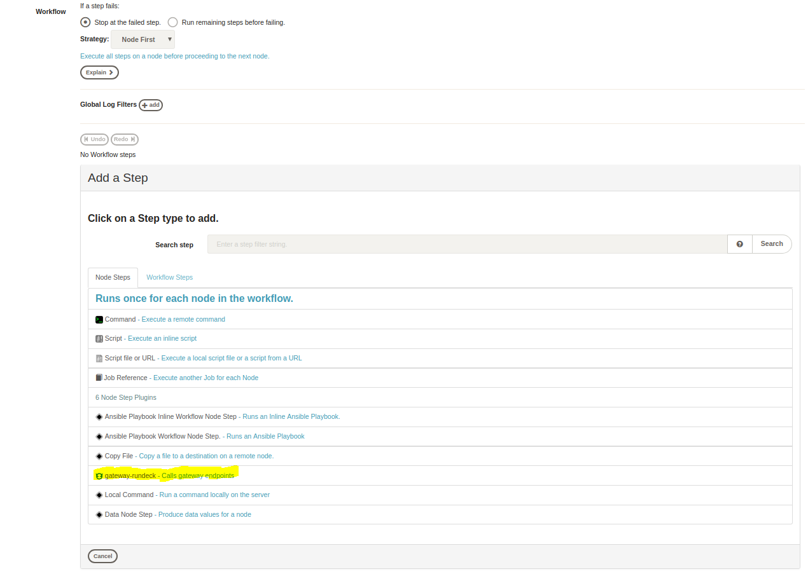

# Rundeck BlueCat Gateway Plugin

This is a Plugin for [Rundeck](https://www.rundeck.com/open-source) 3.0.8 that provides the ability to call BlueCat Gateway endpoints from the Rundeck UI. This Plugin is built to utilize the [rest_api](https://github.com/bluecatlabs/gateway-workflows/tree/master/Community/rest_api) workflow on Gateway Verions [18.10.2](https://quay.io/repository/bluecat/gateway?tag=latest&tab=tags) or greater 

## Prerequisites
* BlueCat Address Manager 3000 appliance or greater running software version 8.2.0 or greater
* BlueCat Gateway [v18.10.2](https://quay.io/repository/bluecat/gateway?tag=latest&tab=tags) or greater

## Requirements
* BlueCat Gateway has [rest_api](https://github.com/bluecatlabs/gateway-workflows/tree/master/Community/rest_api) community workflow installed and permissioned properly
* BlueCat Gateway container running
* Rundeck Instance Running


## Installation
  1. Download and start [Rundeck](http://rundeck.org/downloads.html), or install the docker [version](https://hub.docker.com/r/rundeck/rundeck/) <br /> <br />
  2. Download this repository as a .zip file <br /> <br />
  3. Drop it in your libext folder <br /> <br />
  4. Restart rundeck <br /> <br />

### Installation via Docker
  1. If you are using Rundeck-docker you will need to mount a data volume to libext with: <br />
  ```
  mkdir /plugins
  docker run --name rundeck -v data:/home/rundeck/server/data -v /plugins:/home/rundeck/libext -p 4440:4440 -e RUNDECK_GRAILS_SERVER=http://<ip address of your host machine>:4440 rundeck/rundeck:3.0.8
  ```
  2. Copy the repo into a .zip file, then put the .zip file into /home/rundeck/libext with: <br />
  ```
  docker cp rundeck-bluecat-gateway-plugin.zip rundeck:/home/rundeck/libext/
  ```
  3. Then restart the docker container with : <br />
  ```
  docker stop rundeck 
  docker rm rundeck 
  docker run --name rundeck -v data:/home/rundeck/server/data -v /plugins:/home/rundeck/libext -p 4440:4440 -e RUNDECK_GRAILS_SERVER=http://<ip address of your host machine>:4440 rundeck/rundeck:3.0.8
  ```

## Usage
* Go to the webpage specificed by RUNDECK_GRAILS_SERVER in the docker command or where ever you configured it

* On first login, use the credentials to log in <br /> Username: admin <br /> Password: admin

* Create a Project then a job under the project

* Select the gateway-workflow in the workflow tab 



* When creating a job and fill in the boxes below


* NOTE: The additional data should always be in JSON format


* For complete information on Rundeck refer to https://rundeck.org/docs/


